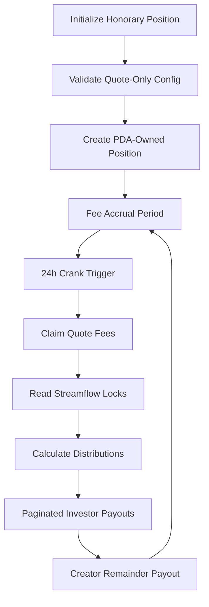
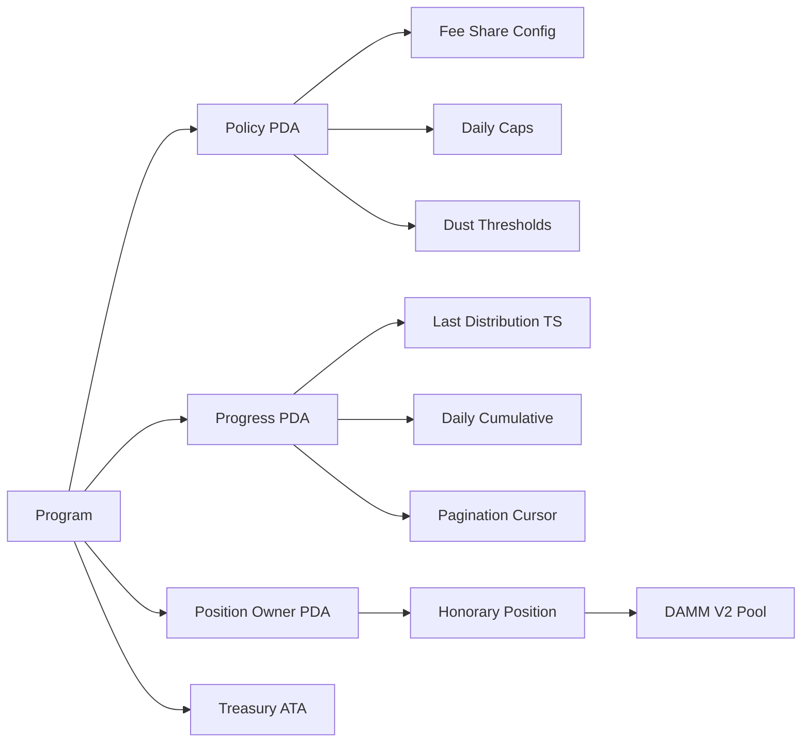

# Design Document

## Overview

The Meteora Fee Router is a Solana Anchor program that implements a sophisticated fee distribution system for DAMM V2 liquidity positions. The system creates an "honorary" LP position that accrues quote-only fees and distributes them to investors based on their vesting schedules from Streamflow, with remaining fees going to project creators.

The architecture follows a two-phase approach: initialization of the honorary position with strict quote-only validation, and a permissionless crank system that handles 24-hour distribution cycles with pagination support.

## Architecture

### High-Level System Flow



### Program Structure

The program consists of two main instruction handlers:
1. **InitializeHonoraryPosition** - Sets up the quote-only fee position
2. **DistributeFees** - Handles the 24-hour distribution crank with pagination

### Account Architecture



## Components and Interfaces

### Core Program Instructions

#### InitializeHonoraryPosition
```rust
pub struct InitializeHonoraryPosition<'info> {
    #[account(mut)]
    pub payer: Signer<'info>,
    
    #[account(
        init,
        payer = payer,
        space = 8 + PolicyConfig::INIT_SPACE,
        seeds = [POLICY_SEED, vault.key().as_ref()],
        bump
    )]
    pub policy_config: Account<'info, PolicyConfig>,
    
    #[account(
        init,
        payer = payer,
        space = 8 + DistributionProgress::INIT_SPACE,
        seeds = [PROGRESS_SEED, vault.key().as_ref()],
        bump
    )]
    pub distribution_progress: Account<'info, DistributionProgress>,
    
    #[account(
        seeds = [VAULT_SEED, vault.key().as_ref(), b"investor_fee_pos_owner"],
        bump
    )]
    pub position_owner_pda: SystemAccount<'info>,
    
    // DAMM V2 Pool accounts
    pub pool: Account<'info, Pool>,
    pub pool_config: Account<'info, PoolConfig>,
    pub quote_vault: Account<'info, TokenAccount>,
    pub base_vault: Account<'info, TokenAccount>,
    
    // Position accounts
    #[account(mut)]
    pub position: Account<'info, Position>,
    
    // Programs
    pub cp_amm_program: Program<'info, CpAmm>,
    pub system_program: Program<'info, System>,
    pub token_program: Program<'info, Token>,
}
```

#### DistributeFees
```rust
pub struct DistributeFees<'info> {
    #[account(mut)]
    pub crank_caller: Signer<'info>,
    
    #[account(
        mut,
        seeds = [POLICY_SEED, vault.key().as_ref()],
        bump
    )]
    pub policy_config: Account<'info, PolicyConfig>,
    
    #[account(
        mut,
        seeds = [PROGRESS_SEED, vault.key().as_ref()],
        bump
    )]
    pub distribution_progress: Account<'info, DistributionProgress>,
    
    #[account(
        seeds = [VAULT_SEED, vault.key().as_ref(), b"investor_fee_pos_owner"],
        bump
    )]
    pub position_owner_pda: SystemAccount<'info>,
    
    #[account(mut)]
    pub honorary_position: Account<'info, Position>,
    
    #[account(mut)]
    pub treasury_ata: Account<'info, TokenAccount>,
    
    #[account(mut)]
    pub creator_ata: Account<'info, TokenAccount>,
    
    // Streamflow accounts (remaining accounts for pagination)
    pub streamflow_program: Program<'info, Streamflow>,
}
```

### Data Models

#### PolicyConfig
```rust
#[account]
pub struct PolicyConfig {
    pub vault: Pubkey,
    pub quote_mint: Pubkey,
    pub creator_wallet: Pubkey,
    pub investor_fee_share_bps: u16,  // Basis points (0-10000)
    pub daily_cap_lamports: Option<u64>,
    pub min_payout_lamports: u64,
    pub y0_total_allocation: u64,  // Total investor allocation at TGE
    pub bump: u8,
}
```

#### DistributionProgress
```rust
#[account]
pub struct DistributionProgress {
    pub vault: Pubkey,
    pub last_distribution_ts: i64,
    pub current_day_distributed: u64,
    pub carry_over_dust: u64,
    pub pagination_cursor: u32,
    pub day_complete: bool,
    pub bump: u8,
}
```

### Quote-Only Validation Logic

The system implements multiple layers of quote-only enforcement:

1. **Pool Configuration Validation**: Analyzes pool tick ranges and price configurations to ensure only quote fees can accrue
2. **Runtime Fee Validation**: Checks claimed fees during crank operations and fails if base tokens are present
3. **Preflight Validation**: Provides deterministic validation before position creation

```rust
pub fn validate_quote_only_config(
    pool: &Pool,
    pool_config: &PoolConfig,
    quote_mint: &Pubkey,
) -> Result<()> {
    // Validate token order
    require!(
        pool.token_mint_a == *quote_mint || pool.token_mint_b == *quote_mint,
        ErrorCode::InvalidQuoteMint
    );
    
    // Analyze tick configuration for quote-only accrual
    let quote_is_token_a = pool.token_mint_a == *quote_mint;
    
    // Implement tick range analysis to ensure only quote fees accrue
    // This involves checking the position's tick range against current pool price
    // to guarantee the position only collects fees in the quote token
    
    Ok(())
}
```

## Data Models

### Fee Distribution Mathematics

The system implements precise mathematical formulas for fee distribution:

```rust
// Core distribution calculation
pub fn calculate_distribution(
    claimed_quote: u64,
    locked_total: u64,
    y0_total: u64,
    investor_fee_share_bps: u16,
) -> (u64, u64) {
    let f_locked = (locked_total as u128 * 10000) / y0_total as u128;
    let eligible_share_bps = std::cmp::min(
        investor_fee_share_bps as u128,
        f_locked
    );
    
    let investor_fee_quote = (claimed_quote as u128 * eligible_share_bps) / 10000;
    let creator_fee_quote = claimed_quote as u128 - investor_fee_quote;
    
    (investor_fee_quote as u64, creator_fee_quote as u64)
}

// Individual investor weight calculation
pub fn calculate_investor_weight(
    investor_locked: u64,
    total_locked: u64,
) -> u128 {
    if total_locked == 0 {
        return 0;
    }
    (investor_locked as u128 * 1_000_000) / total_locked as u128
}
```

### Streamflow Integration

The system integrates with Streamflow to read vesting schedules:

```rust
pub fn read_streamflow_locked_amount(
    stream_account: &AccountInfo,
    current_timestamp: i64,
) -> Result<u64> {
    let stream_data = Stream::try_deserialize(&mut stream_account.data.borrow().as_ref())?;
    
    // Calculate still-locked amount based on vesting schedule
    let elapsed = current_timestamp.saturating_sub(stream_data.start_time);
    let vesting_duration = stream_data.end_time - stream_data.start_time;
    
    if elapsed >= vesting_duration {
        return Ok(0); // Fully vested
    }
    
    let vested_amount = (stream_data.deposited_amount as u128 * elapsed as u128) 
        / vesting_duration as u128;
    
    Ok(stream_data.deposited_amount - vested_amount as u64)
}
```

## Error Handling

### Comprehensive Error Codes

```rust
#[error_code]
pub enum ErrorCode {
    #[msg("Invalid quote mint configuration")]
    InvalidQuoteMint,
    
    #[msg("Base fees detected - quote-only enforcement failed")]
    BaseFeeDetected,
    
    #[msg("24-hour cooldown not elapsed")]
    CooldownNotElapsed,
    
    #[msg("Daily distribution cap exceeded")]
    DailyCapExceeded,
    
    #[msg("Payout below minimum threshold")]
    PayoutBelowMinimum,
    
    #[msg("Invalid pagination cursor")]
    InvalidPaginationCursor,
    
    #[msg("Arithmetic overflow in fee calculation")]
    ArithmeticOverflow,
    
    #[msg("Streamflow account validation failed")]
    StreamflowValidationFailed,
}
```

### Failure Recovery Mechanisms

1. **Idempotent Operations**: All crank operations can be safely retried
2. **Pagination State**: Progress is tracked to allow resumption after failures
3. **Dust Accumulation**: Small amounts are carried forward rather than lost
4. **Account Creation**: Missing ATAs are created according to policy

## Testing Strategy

### Unit Test Coverage

1. **Quote-Only Validation Tests**
   - Valid quote-only configurations
   - Invalid configurations that would accrue base fees
   - Edge cases in tick range analysis

2. **Distribution Logic Tests**
   - Proportional distribution calculations
   - Dust handling and carry-forward
   - Daily cap enforcement
   - Minimum payout thresholds

3. **Pagination Tests**
   - Multi-page distribution scenarios
   - Failure recovery and resumption
   - Cursor state management

4. **Integration Tests**
   - End-to-end flow with mock Streamflow data
   - DAMM V2 pool interaction
   - Event emission verification

### Test Environment Setup

```rust
// Test helper for setting up mock environment
pub struct TestEnvironment {
    pub program_id: Pubkey,
    pub pool: TestPool,
    pub streamflow_streams: Vec<TestStream>,
    pub policy_config: PolicyConfig,
}

impl TestEnvironment {
    pub fn setup_quote_only_scenario() -> Self {
        // Setup test environment with quote-only configuration
    }
    
    pub fn setup_mixed_lock_scenario() -> Self {
        // Setup test with various lock percentages
    }
    
    pub fn setup_dust_scenario() -> Self {
        // Setup test with small amounts for dust testing
    }
}
```

### Performance Considerations

1. **Pagination Optimization**: Efficient handling of large investor sets
2. **Compute Budget**: Careful management of Solana compute units
3. **Account Size**: Optimized data structures for minimal rent costs
4. **Cross-Program Invocation**: Efficient interaction with DAMM V2 and Streamflow

### Security Considerations

1. **PDA Security**: Proper seed derivation and bump validation
2. **Arithmetic Safety**: Overflow protection in all calculations
3. **Access Control**: Proper validation of account ownership
4. **Reentrancy Protection**: Safe state management during cross-program calls

This design provides a robust, secure, and efficient implementation of the Meteora Fee Router that meets all the hackathon requirements while ensuring scalability and maintainability.