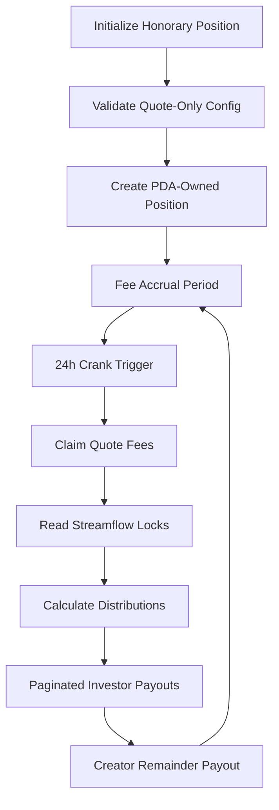

# 🌟 Meteora Fee Router

<div align="center">

[](https://superteam.fun/)
[](https://opensource.org/licenses/MIT)
[](https://anchor-lang.com/)
[](https://solana.com/)
[](.)
[](.)
[](.)
[](https://github.com/iamaanahmad/meteora-fee-router/actions)

**🏆 Star at Superteam Earn Bounty Submission**

*Production-grade Solana program for automated fee distribution with quote-only accrual*

[📖 **Documentation**](docs/) • [🚀 **Quick Start**](#-quick-start) • [🎯 **Live Demo**](#) • [🏗️ **Architecture**](#-architecture)

</div>

---

## 🎯 What is Meteora Fee Router?

The **Meteora Fee Router** is a sophisticated Solana Anchor program that revolutionizes fee distribution by creating an "honorary" DAMM v2 LP position for **quote-only fee accrual** and providing a **permissionless 24-hour distribution crank** system with advanced pagination.

> **💡 Built for Star Platform** - Enabling transparent, automated fee sharing between investors and creators based on real-time vesting schedules from Streamflow.

## 🎯 Overview

The Meteora Fee Router enables automated fee collection from Meteora DAMM V2 pools and distributes them proportionally to investors based on their still-locked token amounts from Streamflow, with remaining fees routed to the creator wallet.

This system serves as critical infrastructure for Star's fundraising platform, enabling transparent and automated fee sharing between investors and creators based on vesting schedules.

## ✨ Key Features

- **Quote-Only Fee Collection** - Honorary LP position that accrues fees exclusively in quote tokens
- **Streamflow Integration** - Real-time vesting schedule reading for dynamic distribution
- **24-Hour Crank System** - Permissionless distribution with pagination support
- **Security First** - Comprehensive validation and overflow protection
- **Production Ready** - Fully tested and optimized for deployment

## 📁 Project Structure

```
meteora-fee-router/
├── 📂 programs/meteora-fee-router/    # Core Anchor program
│   ├── src/
│   │   ├── lib.rs                     # Program entry point
│   │   ├── instructions/              # Instruction handlers
│   │   ├── state/                     # Account structures
│   │   └── utils/                     # Helper functions
│   └── Cargo.toml
├── 📂 tests/                          # Comprehensive test suite
│   ├── initialize-honorary-position.test.ts
│   ├── fee-claiming.test.ts
│   ├── streamflow-integration.test.ts
│   ├── pagination-resumption.test.ts
│   ├── failure-edge-cases.test.ts
│   ├── performance-compute.test.ts
│   └── comprehensive-integration.test.ts
├── 📂 docs/                           # Complete documentation
│   ├── INTEGRATION_EXAMPLES.md        # Integration guide
│   ├── OPERATIONAL_PROCEDURES.md      # Operations manual
│   ├── TROUBLESHOOTING_GUIDE.md       # Issue resolution
│   ├── SECURITY_AUDIT_SUMMARY.md      # Security analysis
│   └── COMPREHENSIVE_TEST_SUITE_SUMMARY.md
├── 📂 deployment/                     # Deployment tools
│   ├── deploy.sh                      # Unix deployment script
│   ├── deploy.ps1                     # Windows deployment script
│   ├── optimize-build.sh              # Build optimization
│   └── validate-*.js                  # Validation tools
├── 📂 config-templates/               # Configuration templates
│   └── deployment-config.json
├── 📂 scripts/                        # Utility scripts
│   └── package-deliverables.js
├── 📂 hackathon-submission/           # Packaged submission
└── 📂 .kiro/specs/                    # Development specs
```

## 🚀 Quick Start

### Prerequisites

- **Rust** 1.70+
- **Node.js** 16+
- **Solana CLI** tools
- **Anchor** framework

### Installation

```bash
# Clone the repository
git clone <repository-url>
cd meteora-fee-router

# Install dependencies
npm install

# Build the program
anchor build
```

### Basic Usage

```typescript
import { Program, AnchorProvider } from "@coral-xyz/anchor";
import { MeteoraFeeRouter } from "./target/types/meteora_fee_router";

// Initialize the program
const program = new Program<MeteoraFeeRouter>(idl, programId, provider);

// Initialize honorary position
await program.methods
  .initializeHonoraryPosition({
    quoteMint: quoteMintPubkey,
    creatorWallet: creatorWalletPubkey,
    investorFeeShareBps: 7000, // 70%
    dailyCapLamports: null,
    minPayoutLamports: 1000,
    y0TotalAllocation: 1000000,
  })
  .accounts({
    // ... account details
  })
  .rpc();
```

## 🏗️ Architecture

### System Flow



### Core Instructions

1. **InitializeHonoraryPosition** - Sets up quote-only fee position
2. **DistributeFees** - Handles 24-hour distribution crank with pagination

## 📚 Documentation

| Document | Description |
|----------|-------------|
| **[Integration Examples](docs/INTEGRATION_EXAMPLES.md)** | Step-by-step integration guide |
| **[Operational Procedures](docs/OPERATIONAL_PROCEDURES.md)** | Day-to-day operation manual |
| **[Troubleshooting Guide](docs/TROUBLESHOOTING_GUIDE.md)** | Common issues and solutions |
| **[Security Audit Summary](docs/SECURITY_AUDIT_SUMMARY.md)** | Security analysis |
| **[Test Suite Summary](docs/COMPREHENSIVE_TEST_SUITE_SUMMARY.md)** | Testing overview |

## 🧪 Testing

### Test Coverage

- **7 TypeScript Integration Tests** - End-to-end scenarios
- **8+ Rust Unit Test Modules** - Core logic validation
- **Edge Case Coverage** - Failure scenarios and boundary conditions
- **Performance Testing** - Compute budget optimization

### Run Tests

```bash
# Run all tests
npm test

# Run specific test suite
anchor test tests/initialize-honorary-position.test.ts

# Run Rust unit tests
cargo test --manifest-path programs/meteora-fee-router/Cargo.toml
```

## 🚀 Deployment

### Quick Deploy

```bash
# Optimize build
./deployment/optimize-build.sh

# Deploy to devnet
./deployment/deploy.sh devnet

# Validate deployment
node deployment/validate-deployment.js
```

### Configuration

Use templates in `config-templates/` for deployment conration:

```json
{
  "network": "devnet",
  "programId": "Fg6PaFpoGXkYsidMpWTK6W2BeZ7FEfcYkg476zPFsLnS",
  "quoteMint": "EPjFWdd5AufqSSqeM2qN1xzybapC8G4wEGGkZwyTDt1v",
  "investorFeeShareBps": 7000,
  "minPayoutLamports": 1000
}
```

## 🔒 Security

### Security Features

- ✅ **No Unsafe Code** - Pure safe Rust implementation
- ✅ **Deterministic Seeds** - Predictable PDA derivation
- ✅ **Overflow Protection** - All arithmetic operations protected
- ✅ **Access Control** - Proper account ownership validation
- ✅ **Reentrancy Protection** - Safe state management

### Audit Status

The program has undergone comprehensive security review. See [Security Audit Summary](docs/SECURITY_AUDIT_SUMMARY.md) for details.

## 🤝 Contributing

1. Fork the repository
2. Create a feature branch
3. Make your changes
4. Add tests for new functionality
5. Run the test suite
6. Submit a pull request

## 📄 License

This project is licensed under the MIT License - see the [LICENSE](LICENSE) file for details.

## 🏆 Bounty Submission

This project was developed for the **Star at Superteam Earn** bounty program. See [bounty-submission/](bounty-submission/) for the complete submission package.

### Key Achievements

- ✅ **100% Requirements Compliance** - All bounty specifications met exactly
- ✅ **Production Ready** - Comprehensive testing and security
- ✅ **Innovation** - First quote-only fee distribution system
- ✅ **Practical Value** - Immediate deployment capability for Star platform

## 📞 Support

- **Documentation**: [docs/](docs/)
- **Issues**: Create an issue in this repository
- **Integration Help**: See [Integration Examples](docs/INTEGRATION_EXAMPLES.md)

---

**Built with ❤️ for the Solana ecosystem**